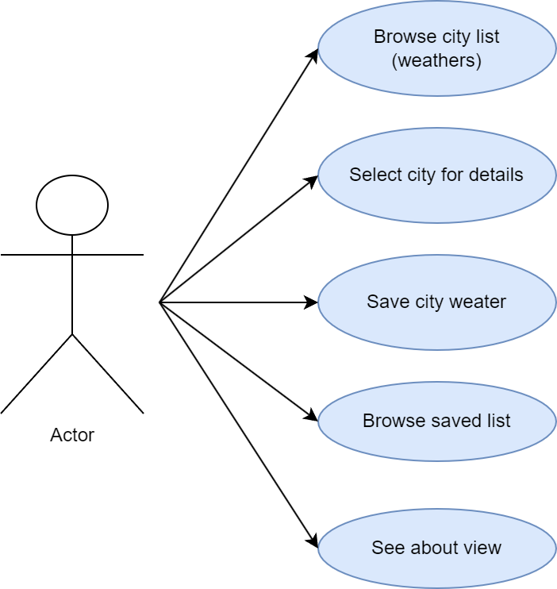
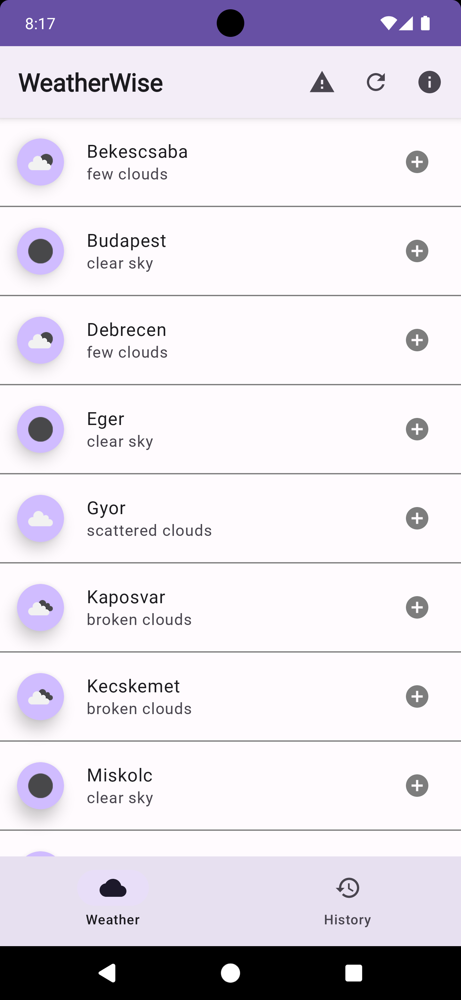
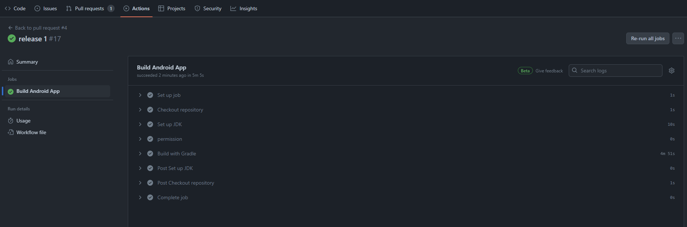
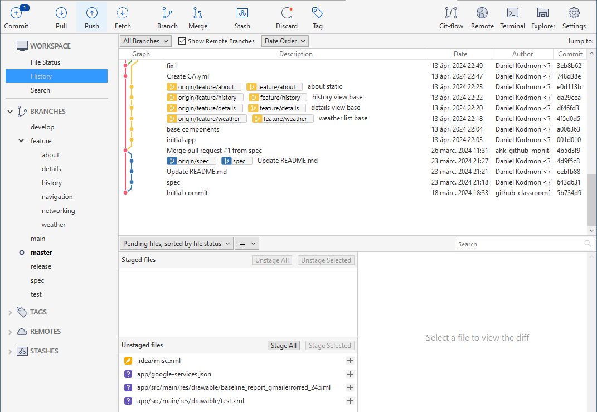
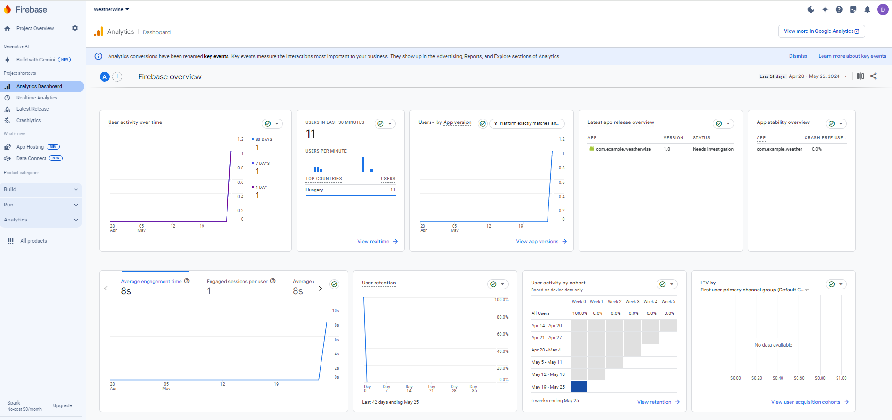
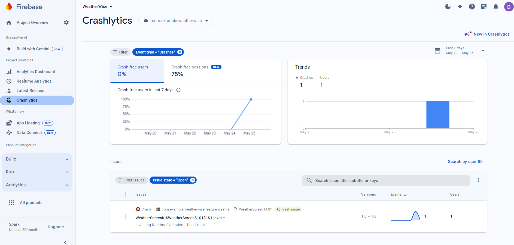
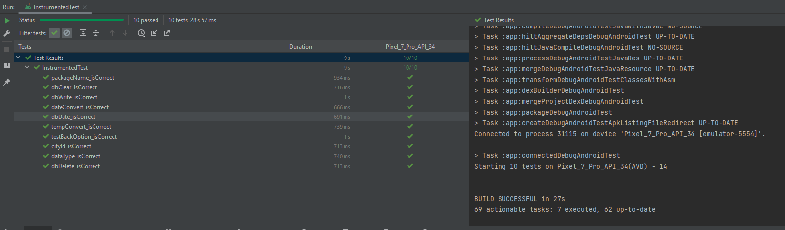

# WeatherWise

Android App (structure practise) 2024

## Introduction

The application is a mobile app for retrieving current weather data. You can retrieve the current weather data of all the county and save it to an offline persistent storage. The app can be useful for users who want to quickly find out what the current weather is like in which county at the moment. The save function allows you to retrieve this data offline.

## Main features

The functions of the application are covered by four pages which are:

### Weather list
On the `Weather` tab of the application, you can see a list of all the county capitals of Hungary. For each city, the name of the city, the current weather of the city in text form (e.g. <i>clear sky</i>) and an icon representing the weather are displayed. The list can be updated by the user (e.g. AppBar icon). In each row there is a `+` icon to download the current weather of the city to your mobile storage.

### Detailed view 
The user has the option to select a city from the weather list (single tap on the list item). A detailed view containing the city's weather data will then open. This includes the city's current temperature, humidity, wind speed and cloud coverage. The user also has the option here to save the weather data to an offline persistent storage using the save button.

### Saved data
The `History` tab allows you to view the weather data previously saved by the user to the mobile storage. Here you can also open the detailed view, but here you can delete from the list instead of saving. The list items display the save date, city name, temperature  and weather in text.

### About view
The icon in the AppBar of the application displays a static `About` page describing the application.

## Screen design

Screen layouts (from left to right) County list, Saved weathers, Detailed view, Information view.

## Architecture and environment

The foundations of the application have been laid. The `api` folder contains the components needed to communicate with the weather API. These include endpoints and data access functions available from viewModels. The `base` contains the base of the application, e.g. MainActivity. The `data` contains the various data classes, DTO-s. The `feature` contains the implementation of each screen.  A feature (in the feature folder) contains a Screen, a ViewModel and a state to store the current state of the screen (feature). Thanks to MVVM, the business logic, the UI and the data classes are separated sufficiently, making e.g. post-editing easier. The `navigation` contains the implementation needed to navigate through the application. The `ui` contains unique and reused ui elements.
 
Successful github actions check and build:

 
GitFlow commits:

## Network and database

### Network layer
The network calls are made using `Retrofit`. I chose `Moshi` to deserialize the json response into model objects. 
Created classes and their responsibilities:
- ApiService: for the Retrofit call implementation. This is the place for any endpoint.
- ApiDataService: this corresponds to the repository. Here you can do various settings before an api call (body, query, etc...) and also manage the success of the call.
- ApiModule: this is a Hilt module that creates and initializes the singletons needed for network communication. This is where we create Retrofit which is injected into ApiService, ApiService which is injected into ApiDataSource and ApiDataSource which we can inject into our viewModels for network calls.
- CityWeather, Clouds, Weather, WeatherMain, WeatherResponse, Wind: data models structured according to the api response, with Moshi json annotation (only the required fields are handled)
- Config: here you find the apiKey, baseUrl, city id list

### Database layer
For persistent data storage the Room database was used. 
- AppDatabase: here I create the database itself which uses the WeatherEntity schema.
- WeatherDao: The DAO interface to the database. Here are defined the different database operations (queries).
- WeatherEntity: data model used by the database. It's definitely worth creating a separate data model, the API data model is unnecessarily overcomplicated, especially if you don't want to save all the data.
- RoomModule: Hilt module that creates and initializes the singletons needed for persistent data storage. It also creates AppDatabase and WeatherDao. WeatherDao will then be injected into the various viewModels.
- DateConverter: converts the Date type for Room to Long type and back.
- WeatherConverter: creates a WeatherEntity from the CityWeather api model that can be stored by Room.

### API description
The application uses the [OpenWeatherMap](https://openweathermap.org/) API to retrieve weather data. Each city is defined by an id. The api has a `/group` endpoint where you can specify multiple city ids in a url query. The use of this endpoint is described in [apiDefinition.yaml](apiDefinition.yaml).

## Tests and analytics

### Firebase analytics. It logs which cities people choose of the city list items.

### Firebase crashlytics. A button has been placed on Appbar that throws an exception when pressed for testability.

### Tests 
Instrumented testing has been set up as the database has also been tested. The MockData file contains the mock data.

`packageName_isCorrect`
This test checks if the application package name is correctly set to "com.example.weatherwise". It checks the context of the application and checks the package name.

`dateConvert_isCorrect`
This test ensures that the date conversion function is working correctly. It converts a given timestamp to date format and checks that the result is "2024.05.25".

`dbDate_isCorrect`
This test checks the conversion of a date to a timestamp. It converts a date to a timestamp and checks that the timestamp matches the expected value.

`tempConvert_isCorrect`
This test validates the conversion of a temperature from Kelvin to Celsius. It converts 295.91 Kelvin to Celsius and checks that the result is 23 degrees Celsius.

`dbWrite_isCorrect`
This test checks if the database save operation is correct. It saves a mock weather entity to the database and checks that the database contains the entity.

`dbClear_isCorrect`
This test ensures that the database clear operation is working correctly. It saves multiple weather entities to the database, then clears the database and checks that the database is empty.

`dbDelete_isCorrect`
This test checks the database delete operation. It saves a weather entity, then deletes it based on UUID and checks that the entity is no longer in the database.

`dataType_isCorrect`
This test checks the conversion of data of type CityWeather to type WeatherEntity. It checks if the converted WeatherEntity matches the expected result.

`cityId_isCorrect`
This test ensures that the city ID query function is working correctly. It gets the city ID of "Szeged" and checks that the result is "715429".

`testBackOption_isCorrect`
This test checks the back navigation option in the user interface. It sets the contents of the About screen and checks that the back button is visible.

