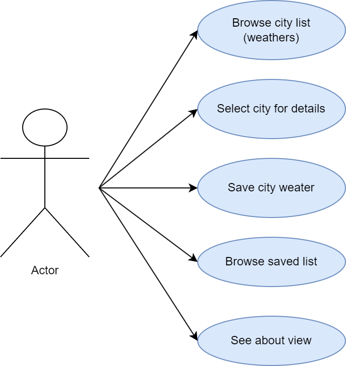
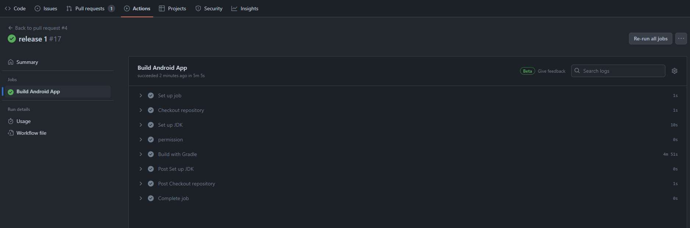
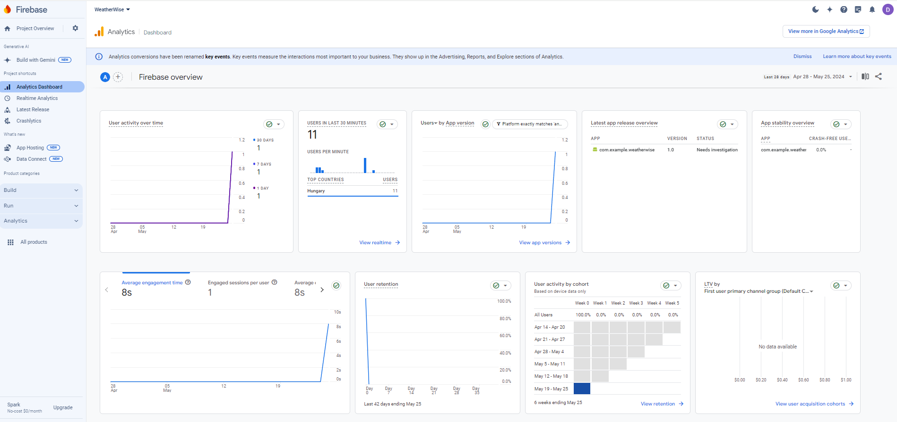
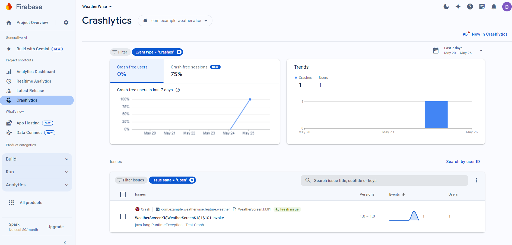

# WeatherWise

Android App (structure practise) 2024

## Bemutatás

Az alkalmazás egy aktuális időjárás adat lekérdezésére szolgáló mobilapp. Lekérdezhető az összess megyeszékhely aktuális időjárásadatai és ezek elmenthetőek offline perzisztens tárba. Az alkalmazás hasznos lehet azon felhasználók számára akik gyorsan szeretnék megtudni hogy pillanatnyilag melyik megyében milyen az aktuális időjárás. A mentés funkció segítségével offline is visszakereshetőek ezek az adatok.

## Főbb funkciók

Az alkalmazás funkcióit négy oldal foglalja magában amelyek a következők.

### Időjárás lista
Az alkalmazás `Weather` tab oldalán egy lista látható Magyarország összes megyeszékhelyével. Minden városnál megjelenik az adott város neve, a város aktuális időjárása szöveges formában (pl.: <i>clear sky</i>) és egy, az időjárást reprezentáló ikon. A lista frissíthető a felhasználó által (pl. AppBar ikon). minden sorban található egy `+` ikon, amivel az adott város aktuális időjárását lementheti a mobil tárhelyére. 

### Részletes nézet
A felhasználónak lehetőségen van kiválasztani egy várost az időjárás listából (single tap a listaelemen). Ekkor megnyílik a város időjárásadatait tartalmazó részletes nézet. Ez tartalmazza a város aktuális hőmérsékletét, páratartalmát, szél sebességét és felhő lefedettségét. A felhasználónak itt is lehetősége van mentés gombbal offline tartós tárba menteni az időjárásadatokat.

### Mentett adatok
A `History` tabon a mobil tárhelyére korábban a felhasználó által lementett időjárásadatok vizsgálhatóak meg. Itt is megnyitható a részletes nézet viszont itt a listából való törlés áll rendelkezésre a mentés helyett. A listaelemek megjelenítik a mentési dátumot, városnevet, hőmérsékletet és a szöveges időjárást.

### About nézet
Az alkalmazás AppBar-jában található ikonnal megjeleníthető az alkalmazást ismertető statikus `About` oldal.

## Képernyődesign

Kérernyőtervek (balról jobbra) Megyeszékhely lista, Mentett időjárások, Részletes nézet, Információs nézet.

## Architektúra és környezet

Az alkalmazás alapjai lefektetésre kerültek. A felépítés a következő képpen néz ki. Az `api` mappa tartalmazza az api-val való kömmunikációhoz szükséges komponeneket. Ilyenek pl a végpontok és a viewModel-ekből elérhető adatelérési függvények. A `base` tartalmazza az alkalmazás alapját, pl. a MainActivity-t. A `data` a különböző adatosztályokat tartalmazza. A `feature` tartalmazza az egyes képernyők megvalósítását. Egy feature (a feature mappában) egy View-t egy ViewModelt-t és egy state-et az állapotok tárolásához (ez utóbbi külön változókra is szétbontható). Az MVVM-nek hála kellően elkülönül így az üzleti logika, a UI és az adatosztály, megkönnyíte pl. az utólagos módosításokat is. A `navigation` tartalmazza az alkalmazáson bellüli navigációhoz szükséges megvalósítást. A `ui` egyedi és többször felhasznált ui elemeket tartalmazza.   
 
Sikeres github actions build:

 
GitFlow commitok:

## Hálózat és adatbázis

### Hálózat
A hálózati hívás `Retrofit` segítségével történik. A kapott json válasz model objektumokba való deszerializálására a `Moshi`-t választottam. 
Létrehozott osztályok és felelősségeik:
 - ApiService: a Retrofit hívásmegvalósításhoz. Itt a helye bármilyen végpontnak.
 - ApiDataService: ez a repositorynak felel meg. Itt végezhetünk különböző beállításokat api hívás előtt (body, query, stb...) illetve itt le is tudjuk kezelni a hívás sikerességét is.
 - ApiModule: ez egy Hilt modul ami a hálózati kommunikációhoz szükséges singletonokat hozza létre és inicializálja. Itt jön létre a Retrofit, amely injektálásrta kerül az ApiService számára, az ApiService amely injektálásrta kerül ApiDataSource számára és az ApiDataSource amelyet be tudunk injektálni a viewModeljeinkbe a hálózati hívásokhoz.
 - CityWeather, Clouds, Weather, WeatherMain, WeatherResponse, Wind: adatmodellek az api válaszának megfelelően struktúrálva, Moshi json annotációval ellátva. (csak a szükséges mezőket kezelem)
 - Config: Itt található az apiKulcs, baseUrl, város id lista

### Adatbázis
A perzisztens adattárolásra a Room adatbázis lesz használva. 
 - AppDatabase: itt hozom létre magát az adatbázist ami a WeatherEntity sémát használja.
 - WeatherDao: Az adatbázis DAO interfésze. It vannak definiálva a különböző adatbázis műveletek. (Query-k)
 - WeatherEntity: adatmodell amelyet az adatbázis használ. Mindenképpen érdemes külön adatmodellt létrehozni, az API adatmodellje szükségtelenül túl van bonyolítva, pláne hogy nem minden adatot akarunk menteni.
 - RoomModule: Hilt modul ami a perzisztens adattároláshoz szükséges singletonokat hozza létre és inicializálja. Létrehozza az AppDatabase-t és a WeatherDao-t is. A WeatherDao ezekután injektálható lesz a különböző viewModelekbe.
 - DateConverter: A Room számára a Date típust konvertálja Long-ra és vissza.
 - WeatherConverter: CityWeather api modelből hoz létre Room által tárolható WeatherEntity-t.

### API leírás
Az alkalmazás az [OpenWeatherMap](https://openweathermap.org/) API-ját használja az időjárásadatok lekéréséhez. Az egyes városokat egy-egy id határoz meg. Az api rendelkezik egy `/group` végpontal aminél url query-ben megadható több város id is. A végpont használatát az [apiDefinition.yaml](apiDefinition.yaml) mutatja be. 

## Tesztek és analitika

### Firebase analytics. A városlista elemekre logol, hogy melyik várost választják az emberek.

### Firebase crashlytics. Appbar-on lett egy gomb ami megnyomásra kivételt dob.

### Tesztek
Instrumentált tesztelés lett létrehozva ugyanis az adatbázis is tesztelésre került. A MockData file tartalmazza a mock adatokat.

`packageName_isCorrect`
Ez a teszt ellenőrzi, hogy az alkalmazás csomagneve helyesen van-e beállítva "com.example.weatherwise"-re. Lekéri az alkalmazás kontextusát és ellenőrzi a csomagnevet.

`dateConvert_isCorrect`
Ez a teszt biztosítja, hogy a dátumkonvertáló függvény megfelelően működik. Egy adott időbélyeget dátum formátumra konvertál és ellenőrzi, hogy az eredmény "2024.05.25" legyen.

`dbDate_isCorrect`
Ez a teszt ellenőrzi a dátum időbélyeggé történő átalakítását. Egy dátumot időbélyeggé konvertál és ellenőrzi, hogy az időbélyeg megfelel az elvárt értéknek.

`tempConvert_isCorrect`
Ez a teszt érvényesíti a hőmérséklet átváltását Kelvinről Celsiusra. 295.91 Kelvint Celsiusra konvertál és ellenőrzi, hogy az eredmény 23 celsius fok legyen.

`dbWrite_isCorrect`
Ez a teszt ellenőrzi, hogy az adatbázis mentési művelete helyesen működik-e. Egy mock időjárás entitást ment az adatbázisba és ellenőrzi, hogy az adatbázis tartalmazza-e az entitást.

`dbClear_isCorrect`
Ez a teszt biztosítja, hogy az adatbázis törlési művelete megfelelően működik. Több időjárás entitást ment az adatbázisba, majd törli az adatbázist és ellenőrzi, hogy az adatbázis üres legyen.

`dbDelete_isCorrect`
Ez a teszt ellenőrzi az adatbázis törlési műveletét. Egy időjárás entitást ment, majd törli UUID alapján és ellenőrzi, hogy az entitás már nem található az adatbázisban.

`dataType_isCorrect`
Ez a teszt ellenőrzi a CityWeather típusú adat WeatherEntity típusúvá történő konvertálását. Ellenőrzi, hogy a konvertált WeatherEntity megegyezik-e a várt eredménnyel.

`cityId_isCorrect`
Ez a teszt biztosítja, hogy a város ID lekérő függvény megfelelően működik. Lekéri "Szeged" város ID-jét és ellenőrzi, hogy az eredmény "715429" legyen.

`testBackOption_isCorrect`
Ez a teszt ellenőrzi a vissza navigációs opciót a felhasználói felületen. Az About képernyő tartalmát állítja be és ellenőrzi, hogy a vissza gomb látható legyen.
